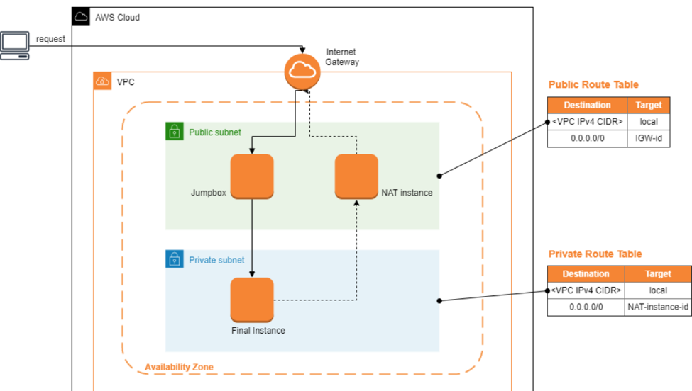
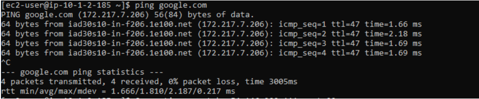

# JumpBox_AWS

## Create a Virtual Private Cloud (VPC)
Select "Create VPC" in Your VPCs. I called my VPC "Fouad_A19" with an IP v4 address : 10.0.0.0/16

 
Public instances
- Launch an NAT instance, in EC2 select in AMI community amzn-ami-vpc-nat enable public IP (it is also possible to allocate an elastic IP), select the VPC we created, we keep the default storage. Name the instance : NAT INSTANCE for example Create a security group and give it a name SG_NAT_Instance (In inbound and outbound rule accept connections from the private subnet IP v4 : 10.0.100.0/24). Create a key pair as we should have 1 key pair per machine.
-Create a JumpBox instance : Select a free tier machine, associate it to the VPC, enable a public IP, create a key pair. Give a name to the JumpBox instance JumpBox, and associate it to a security group SG_JumpBox
Private instance
-Private instance : Let's call it Final Instance, we must disable public IP we put instance in private subnet then we create another key pair associated to the instance. Accept inbound connection from the security group of the JumpBox via SSH.

## Create Public Subnet & Private Subnet

Create a public subnet and attach it to our VPC, put an IP v4 address : 10.0.1.0/24. Route table click on route table itself in route table (in left we will be in route table) Select internet gateway and allow access to every IP address.
For the private subnet : In create subnet,select our VPC, put an IP v4 address for example : 10.0.2.0/24. Do not associate the private subnet to the internet gateway. Create a public route table associated with the VPC and an internet gateway.  Create a private route table (different from the public route table) associated with the VPC and the NAT Instance (not to the internet gateway).

 
 

## Create Security Group:
Need to Edit Inbound and outbound rules.

Launch an instance into your public subnet from an AMI that's been configured to run as a NAT instance. Amazon provides Amazon Linux AMIs that are configured to run as NAT instances. These AMIs include the string amzn-ami-vpc-nat in their names, so you can search for them in the Amazon EC2 console. 
Create another instance which would act as Jump Box
Create a private instance
Once all the three instances are deployed
1)	Copying key of private instance to your jump box using scp .
2)	Connect the jumpbox using ssh
3)	Connect the private instance using ssh
## Update a key on JumpBox instance.
Let permissions : chmod 0600 FI_KeyPair.pem Connection to the private instance : ssh -i DC_KeyPair.pem ec2-user@"Final Instance's IP" and ping google.com (172.217.7.206).

Thanx!

